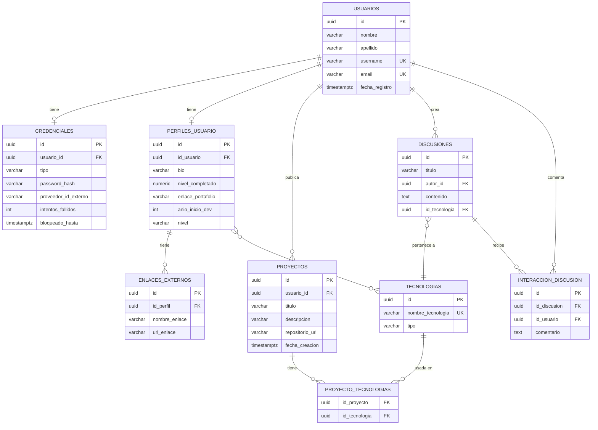

# Modelo de Base de Datos   
Red social para desarrolladores: perfiles técnicos, publicación de proyectos,
discusiones por tecnología y sistema de comentarios.

## 1. Entidades y relaciones

```mermaid
erDiagram
    USUARIOS ||--o| CREDENCIALES : "tiene"
    USUARIOS ||--o| PERFILES_USUARIO : "tiene"
    USUARIOS ||--o{ PROYECTOS : "publica"
    USUARIOS ||--o{ DISCUSIONES : "crea"
    USUARIOS ||--o{ INTERACCION_DISCUSION : "comenta"

    PERFILES_USUARIO ||--o{ ENLACES_EXTERNOS : "tiene"
    PERFILES_USUARIO }o--o{ TECNOLOGIAS : "habilidades"

    PROYECTOS ||--o{ PROYECTO_TECNOLOGIAS : "tiene"
    TECNOLOGIAS ||--o{ PROYECTO_TECNOLOGIAS : "usada en"
    DISCUSIONES }o--|| TECNOLOGIAS : "pertenece a"
    DISCUSIONES ||--o{ INTERACCION_DISCUSION : "recibe"

    USUARIOS {
        uuid id PK
        varchar nombre
        varchar apellido
        varchar username UK
        varchar email UK
        timestamptz fecha_registro
    }
    CREDENCIALES {
        uuid id PK
        uuid usuario_id FK
        varchar tipo
        varchar password_hash
        varchar proveedor_id_externo
        int intentos_fallidos
        timestamptz bloqueado_hasta
    }
    PERFILES_USUARIO {
        uuid id PK
        uuid id_usuario FK
        varchar bio
        numeric nivel_completado
        varchar enlace_portafolio
        int anio_inicio_dev
        varchar nivel
    }
    ENLACES_EXTERNOS {
        uuid id PK
        uuid id_perfil FK
        varchar nombre_enlace
        varchar url_enlace
    }
    TECNOLOGIAS {
        uuid id PK
        varchar nombre_tecnologia UK
        varchar tipo
    }
    PROYECTOS {
        uuid id PK
        uuid usuario_id FK
        varchar titulo
        varchar descripcion
        varchar repositorio_url
        timestamptz fecha_creacion
    }
    PROYECTO_TECNOLOGIAS {
        uuid id_proyecto FK
        uuid id_tecnologia FK
    }
    DISCUSIONES {
        uuid id PK
        varchar titulo
        uuid autor_id FK
        text contenido
        uuid id_tecnologia FK
    }
    INTERACCION_DISCUSION {
        uuid id PK
        uuid id_discusion FK
        uuid id_usuario FK
        text comentario
    }
```

