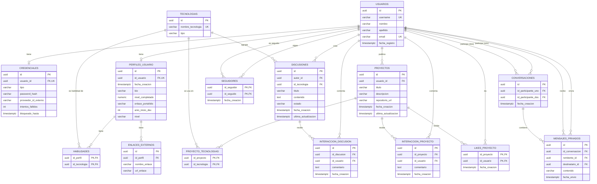

```mermaid
erDiagram
    USUARIOS ||--o| CREDENCIALES : "tiene"
    USUARIOS ||--o| PERFILES_USUARIO : "tiene"
    USUARIOS ||--o{ PROYECTOS : "publica"
    USUARIOS ||--o{ DISCUSIONES : "crea"
    USUARIOS ||--o{ INTERACCION_DISCUSION : "comenta"
    USUARIOS ||--o{ INTERACCION_PROYECTO : "comenta"
    USUARIOS ||--o{ LIKES_PROYECTO : "da"
    USUARIOS ||--o{ SEGUIDORES : "sigue"
    USUARIOS ||--o{ SEGUIDORES : "es seguido"
    USUARIOS ||--o{ CONVERSACIONES : "participa (uno)"
    USUARIOS ||--o{ CONVERSACIONES : "participa (dos)"
    USUARIOS ||--o{ MENSAJES_PRIVADOS : "envía"
    USUARIOS ||--o{ MENSAJES_PRIVADOS : "recibe"

    PERFILES_USUARIO ||--o{ ENLACES_EXTERNOS : "tiene"
    PERFILES_USUARIO ||--o{ HABILIDADES : "tiene"
    TECNOLOGIAS ||--o{ HABILIDADES : "es habilidad de"

    PROYECTOS ||--o{ PROYECTO_TECNOLOGIAS : "usa"
    TECNOLOGIAS ||--o{ PROYECTO_TECNOLOGIAS : "se usa en"
    PROYECTOS ||--o{ LIKES_PROYECTO : "recibe"
    PROYECTOS ||--o{ INTERACCION_PROYECTO : "recibe"

    TECNOLOGIAS ||--o{ DISCUSIONES : "agrupa"
    DISCUSIONES ||--o{ INTERACCION_DISCUSION : "recibe"

    CONVERSACIONES ||--o{ MENSAJES_PRIVADOS : "contiene"

    USUARIOS {
        uuid id PK
        varchar username UK
        varchar nombre
        varchar apellido
        varchar email UK
        timestamptz fecha_registro
    }
    CREDENCIALES {
        uuid id PK
        uuid usuario_id FK, UK
        varchar tipo
        varchar password_hash
        varchar proveedor_id_externo
        int intentos_fallidos
        timestamptz bloqueado_hasta
    }
    PERFILES_USUARIO {
        uuid id PK
        uuid id_usuario FK, UK
        timestamptz fecha_creacion
        varchar bio
        numeric nivel_completado
        varchar enlace_portafolio
        int anio_inicio_dev
        varchar nivel
    }
    ENLACES_EXTERNOS {
        uuid id PK
        uuid id_perfil FK
        varchar nombre_enlace
        varchar url_enlace
    }
    TECNOLOGIAS {
        uuid id PK
        varchar nombre_tecnologia UK
        varchar tipo
    }
    HABILIDADES {
        uuid id_perfil PK, FK
        uuid id_tecnologia PK, FK
    }
    PROYECTOS {
        uuid id PK
        uuid usuario_id FK
        varchar titulo
        varchar descripcion
        varchar repositorio_url
        timestamptz fecha_creacion
        timestamptz ultima_actualizacion
    }
    PROYECTO_TECNOLOGIAS {
        uuid id_proyecto PK, FK
        uuid id_tecnologia PK, FK
    }
    LIKES_PROYECTO {
        uuid id_proyecto PK, FK
        uuid id_usuario PK, FK
        timestamptz fecha_creacion
    }
    INTERACCION_PROYECTO {
        uuid id PK
        uuid id_proyecto FK
        uuid id_usuario FK
        text comentario
        timestamptz fecha_creacion
    }
    SEGUIDORES {
        uuid id_seguidor PK, FK
        uuid id_seguido PK, FK
        timestamptz fecha_creacion
    }
    DISCUSIONES {
        uuid id PK
        uuid autor_id FK
        uuid id_tecnologia FK
        varchar titulo
        text contenido
        varchar estado
        timestamptz fecha_creacion
        timestamptz ultima_actualizacion
    }
    INTERACCION_DISCUSION {
        uuid id PK
        uuid id_discusion FK
        uuid id_usuario FK
        text comentario
        timestamptz fecha_creacion
    }
    CONVERSACIONES {
        uuid id PK
        uuid id_participante_uno FK
        uuid id_participante_dos FK
        timestamptz fecha_creacion
    }
    MENSAJES_PRIVADOS {
        uuid id PK
        uuid id_conversacion FK
        uuid remitente_id FK
        uuid destinatario_id FK
        varchar contenido
        timestamptz fecha_envio
    }
```
